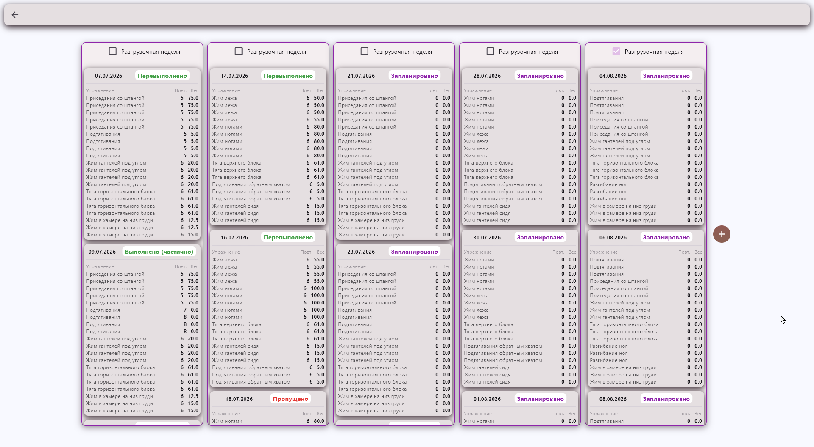
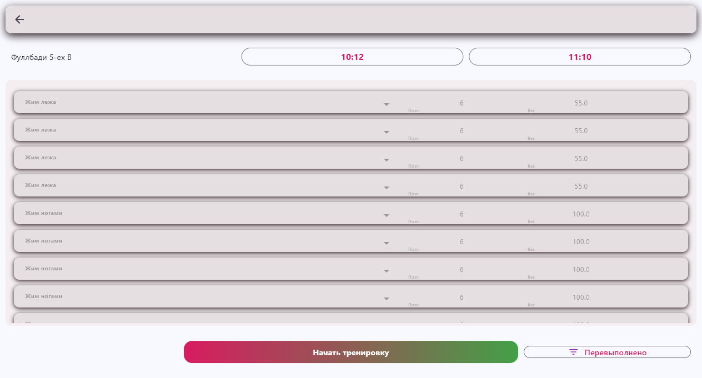
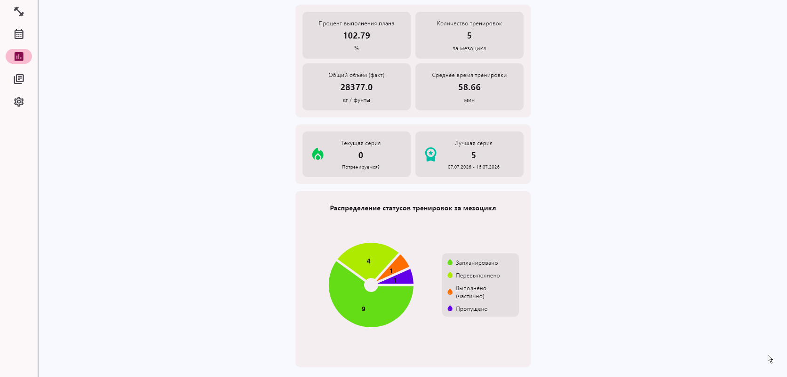
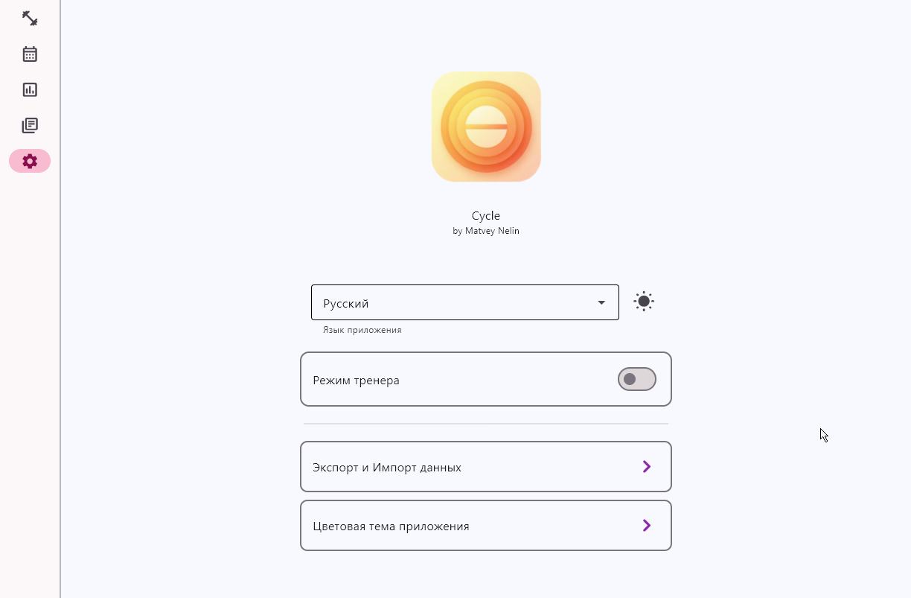

# 🏋️‍♂️ Дневник Тренировок

[](https://www.python.org/)
[](https://flet.dev/)
[](https://www.sqlite.org/)
[](LICENSE)

> Кроссплатформенное приложение для планирования, отслеживания и анализа тренировок.  
> Работает локально, не требует сервера и хранит данные в SQLite.

---

## 📖 Описание
**Дневник Тренировок** помогает структурировать тренировочный процесс: создавать программы, фиксировать подходы/вес/повторы, отслеживать прогресс и визуализировать результаты. Интерфейс построен на `Flet`, что позволяет запускать приложение на Windows, macOS, Linux, Android и в браузере с минимальными изменениями в коде.

## ✨ Возможности
- 📅 Планирование сплитов и отдельных тренировок
- 📊 Учёт подходов, веса, повторений и отдыха
- 🔍 История с фильтрацией по дате, упражнению или группе мышц
- 💾 Локальное хранение в SQLite (работает офлайн)
- 🌐 Кроссплатформенный UI (Desktop / Mobile / Web)
- 🔄 Экспорт/импорт данных (db/zip)

## 🛠 Технологии
| Компонент | Версия / Описание |
|-----------|-------------------|
| `Python`  | 3.10+             |
| `Flet`    | 0.85.1            |
| `SQLite`  | встроенный модуль `sqlite3` |
| `Графики` | `matplotlib`|

## 📸 Скриншоты
| Экран планирования | Учет тренировок | Статистика тренировок | Настройки приложения |
|:------------------:|:------------------:|:-----------------:|:-----------------:|
|  |  |  |  |

## 🚀 Установка и запуск

### 1. Клонирование репозитория
```bash
git clone https://github.com/matvey-nelin/Cycle.git
cd Cycle
```
